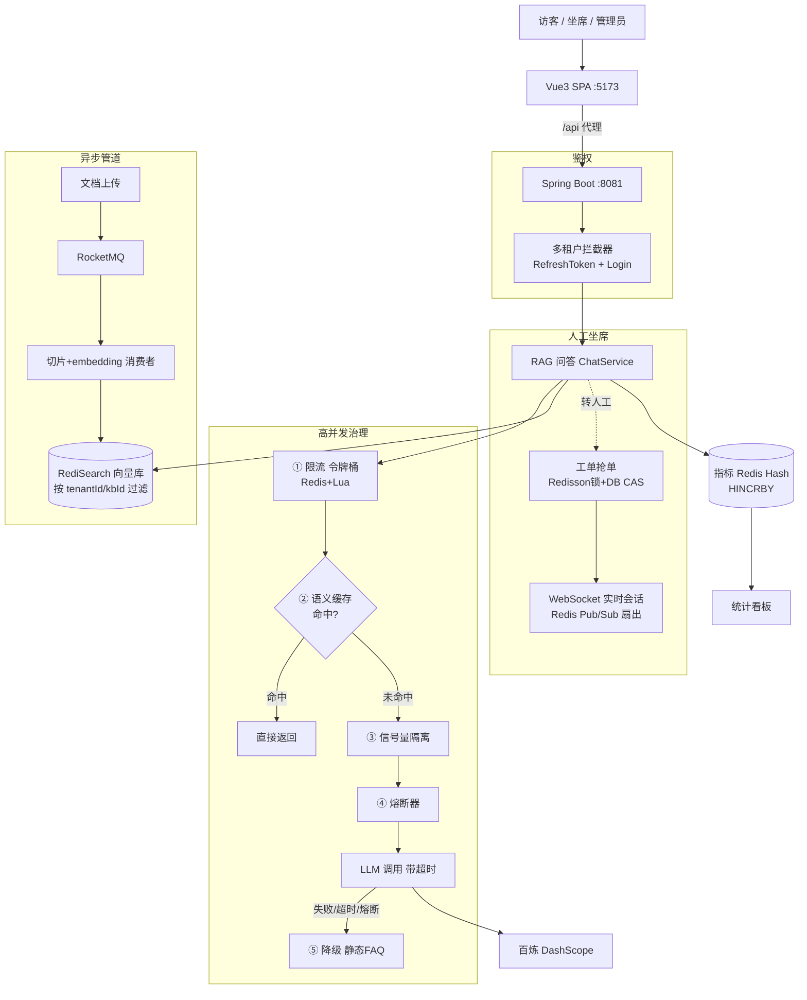

# AI 智能客服平台(多租户 SaaS)

> 用一套**高并发治理体系**驯服「又慢又贵」的 LLM 后端——语义缓存、限流、租户隔离、熔断降级、异步削峰。


一个**多租户的 AI 智能客服 SaaS 平台**:基于知识库的 RAG 问答(向量召回 + 引用来源)、答不上来转人工、坐席实时接待、管理员统计看板。技术核心**不在于"接个大模型聊天",而在于用一整套高并发治理把一个慢(单次 1~3s)、贵(按 token 计费)、有 provider 限流的 LLM 后端服务化、规模化**。

> 本仓库由经典练习项目「黑马点评」**业务域整体改造**而来,**复用其 Redis / 中间件基建**(鉴权拦截器、缓存工具、分布式锁、雪花 ID、Stream 经验),业务替换为生产形态的 AI 客服。原点评业务代码保留但已停用(仅作基建参考)。

---

## ✨ 核心亮点

| 亮点 | 一句话说明 |
|---|---|
| 🧠 **语义缓存** | 不是精确 key,而是按**向量相似度**命中相似问题(阈值 0.92),把缓存三件套(穿透/击穿/雪崩)搬到向量检索上 |
| 🛡️ **高并发治理四件套** | Redis+Lua 令牌桶限流(租户+用户双层)· 按租户信号量隔离(Bulkhead)· 手搓 Redis **跨实例**熔断器 · 静态 FAQ 降级兜底 |
| 🎫 **秒杀同源抢单** | 多坐席抢一张工单:Redisson 锁(腰带)+ DB 条件更新 CAS(背带)双保险,保证**只有一人抢到** |
| 🏢 **多租户逻辑隔离** | 一套部署服务 N 个租户,每表带 `tenant_id`,服务层永远按 `UserContext.getTenantId()` 过滤,跨租户"查不到"即隔离 |
| 📊 **统计看板 + 压测** | 每租户 Redis Hash 原子计数(含**真实 token 消耗**)· JMeter 吞吐压测 + 手搓 PowerShell 断言脚本 |
| ⚡ **异步削峰管道** | 文档摄入(切片 + embedding)走 RocketMQ,峰值被 MQ 缓冲,不阻塞用户请求 |

---

## 🧩 技术栈

**后端** Spring Boot 3.4.5 · Java 21 · MyBatis-Plus · Spring AI(接阿里百炼 DashScope:`qwen-plus` 对话 + `text-embedding-v3` 1024 维向量)
**存储/中间件** MySQL 8 · Redis Stack(RediSearch 向量检索 + Pub/Sub)· RocketMQ 5.x · Redisson
**实时** WebSocket(`/ws/chat`)+ Redis Pub/Sub 跨实例扇出
**前端** Vue 3 + Vite + Element Plus + Pinia + Vue Router(`frontend-new/`)

---

## 🏗️ 架构总览



**一次 `/chat` 问答链路**:鉴权拿 `tenantId/userId` → **①限流** → **②语义缓存**(命中即返回,不耗任何治理/LLM 资源)→ 未命中 → **③信号量 acquire** → **④熔断 allow** → 向量召回 + 拼 Prompt + 多轮历史 → **LLM 带超时调用** → 成功则回填缓存/存历史/埋点 token,失败/超时/熔断/过载则 **⑤降级**返回静态 FAQ。

---

## 📦 里程碑

| 里程碑 | 内容 |
|---|---|
| **M0** | Docker 中间件编排(MySQL + Redis Stack + RocketMQ) |
| **M1** | 多租户骨架:租户模型 + 租户感知鉴权 + 租户/知识库 CRUD |
| **M2** | 知识库异步摄入管道:上传 → RocketMQ → 切片 + embedding → RediSearch |
| **M3** | RAG 问答:向量召回(按 tenant/kb 过滤)→ 拼 Prompt + 引用 → LLM → 非流式 `/chat` & SSE `/chat/stream` + Redis 多轮上下文 |
| **M4** | 语义缓存:相似问命中(0.92)+ 缓存三件套(空值/互斥/随机TTL) |
| **M5** | 高并发治理:限流 + 隔离 + 熔断 + 降级 + 故障注入混沌演示 |
| **M6** | 人工坐席:转人工工单 → 多坐席抢单 → WebSocket 实时会话(Pub/Sub 跨实例) |
| **M7** | 统计看板(含真实 token)+ JMeter / PowerShell 压测 |
| **前端 SPA** | 五个页面:登录注册 / 知识库管理 / 访客问答(SSE)/ 坐席工作台(WS)/ 管理看板 |

> 全部里程碑(M0–M7)+ 前端 SPA 均已完成。详细设计见 [`AI智能客服平台-改造设计方案.md`](./AI智能客服平台-改造设计方案.md),进度与变更日志见 [`项目进度.md`](./项目进度.md),架构说明见 [`CLAUDE.md`](./CLAUDE.md)。

---

## 🚀 快速开始

需要 **Docker** + **百炼(DashScope)API Key**(本地开发额外需要 Java 21 / Maven / Node)。

### 方式一:全栈一键(Docker,推荐)

中间件 + 后端 + 前端全部容器化,一条命令拉起:

```bash
cp .env.example .env          # 填入 DASHSCOPE_API_KEY(百炼控制台获取)
docker compose up -d --build  # 首次构建会下载依赖,稍慢
```

打开 **http://localhost:8080**,用 `acme_admin` / `123456` 登录即可。`docker compose down` 停止(加 `-v` 连数据卷清空)。

> 全新数据卷首次启动会自动建表 + 灌入 demo 租户/账号(`deploy/mysql/init/01~03.sql`),开箱即用。

### 方式二:本地开发(后端/前端跑宿主机,热重载)

```bash
# 1) 仅中间件
cd deploy && docker compose up -d
# 端口:MySQL :3308(库 ai_customer_service,root/123456)· Redis Stack :6381(RedisInsight :8001)· RocketMQ :9876 / Dashboard :8089

# 2) 后端(:8081)—— 用 PowerShell 启动,继承用户级、带连字符的 API-KEY 环境变量
cd backend && mvn clean package -DskipTests
java -jar target/hm-dianping-0.0.1-SNAPSHOT.jar

# 3) 前端(:5173)—— Vite 代理 /api(去前缀)+ /ws 到后端
cd frontend-new && npm install && npm run dev
```

> 两种方式勿同时启动(中间件端口会撞)。方式二的 API Key 走系统环境变量 `API-KEY`,方式一走 `.env` 的 `DASHSCOPE_API_KEY`,后端配置 `${DASHSCOPE_API_KEY:${API-KEY:}}` 两者兼容。

### Demo 账号
`acme_admin` / `globex_admin`(管理员,密码 `123456`,分属租户 `acme` / `globex`);坐席 `acme_agent1` / `acme_agent2`。

---

## 📈 压测结果(单机 / 演示参数 / qwen-plus)

用 `loadtest/` 下的 JMeter 计划 + PowerShell 断言脚本验证治理效果:

| 实验 | 设置 | 关键结论 |
|---|---|---|
| **限流可视化** | 20 线程 × 10 循环 = 200 次 | 用户桶仅 5 → **191/200 被 429 限流**;看板 `rateLimited` 与 429 数完全吻合 |
| **真实 LLM 吞吐** | 调大用户桶,3 并发 × 8,CSV 16 个不同问题 | 24 次 = **16 次真实 LLM 调用 + 8 次缓存命中**,token **+3320**,p50 **1.3s** / p95 2.0s |
| **多租户隔离** | ACME 15 并发洪峰 ‖ GLOBEX 2 并发平稳 | ACME **33/60 被 429**,**GLOBEX 10/10 全 200**——一个租户暴涨完全不波及另一个 |

> 真实 LLM 吞吐被「LLM 单次延迟 × 信号量并发闸门」卡住属行业常态;系统的吞吐倍增器是**语义缓存**(命中 ~200ms、零 LLM 调用),且治理组件均为 **Redis+Lua 跨实例设计**,生产可多实例横向扩展。

```powershell
# JMeter 吞吐压测(HTML 报告 + 驱动看板)
jmeter -n -t loadtest/chat-load.jmx -l result.jtl -e -o report
# 断言型并发(抢单 only-one-winner / 熔断状态机 / 限流隔离)
./loadtest/ticket-grab.ps1
./loadtest/circuit-breaker.ps1 -KbId <kbId>
./loadtest/rate-limit-isolation.ps1 -KbId <kbId>
```

---

## 🗂️ 目录结构

```
├── backend/         # Spring Boot 主工程(所有 mvn 命令在此目录跑)
│   └── src/main/java/com/hmdp/
│       ├── auth/        多租户鉴权(ThreadLocal + 双拦截器)
│       ├── controller/  Auth / Tenant / KnowledgeBase / Chat / Governance / Ticket / Dashboard
│       ├── service/     业务逻辑(ChatService RAG 管道、TicketService 抢单 …)
│       ├── cache/       SemanticCache 语义缓存(缓存三件套)
│       ├── governance/  RateLimiter / TenantBulkhead / LlmCircuitBreaker / FaultInjector
│       ├── mq/          RocketMQ 文档摄入管道
│       ├── ws/          WebSocket 实时会话 + Redis Pub/Sub 扇出
│       ├── metrics/     MetricsCollector 指标埋点
│       └── config/      向量库 / Redisson / RocketMQ / WebSocket / MVC 配置
├── frontend-new/    # 新平台 SPA(Vue 3 + Vite + Element Plus)
├── deploy/          # docker-compose 中间件编排 + MySQL 初始化脚本
├── loadtest/        # JMeter 压测计划 + PowerShell 断言脚本
└── frontend/        # 旧点评 nginx SPA(仅参考,已被 frontend-new 取代)
```

---

## 📝 说明

- 原「黑马点评」业务代码(shop/blog/voucher/follow/user)仍在仓库且可编译,但**已停用**——其表不在新库、接口在新鉴权门后,仅作基建/参考。
- 治理阈值(限流容量、信号量名额、熔断参数等)集中在 `constant/GovernanceConstants`,演示用小值,生产按压测调大即可。
